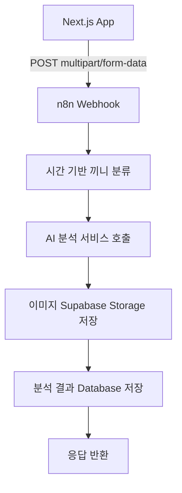

# n8n 워크플로우 구현 가이드

## 개요
AI 식단 관리 서비스의 핵심인 n8n 워크플로우 구현을 위한 상세 가이드입니다. Next.js 앱에서 이미지를 받아 AI 분석을 거쳐 Supabase에 저장하는 전체 프로세스를 자동화합니다.

## 워크플로우 개요

### 전체 플로우


### 처리 시간 예상
- **전체 플로우**: 15-30초
- **AI 분석**: 10-20초 (가장 오래 걸리는 단계)
- **이미지 저장**: 2-5초
- **DB 저장**: 1-2초

---

## 1. 웹훅 트리거 설정

### 기본 설정
```json
{
  "node": "Webhook",
  "settings": {
    "httpMethod": "POST",
    "path": "food-analysis",
    "responseMode": "responseNode",
    "options": {
      "rawBody": false,
      "ignoreBots": true
    }
  }
}
```

### 예상 입력 데이터
```typescript
// multipart/form-data 형식
interface WebhookInput {
  image: Buffer; // 이미지 바이너리 데이터
  userId: string; // Supabase 사용자 ID
}
```

### 테스트 방법
```bash
# cURL을 이용한 테스트
curl -X POST \
  https://your-n8n-instance.com/webhook/food-analysis \
  -F "image=@test-food.jpg" \
  -F "userId=test-user-id"
```

---

## 2. 시간 기반 끼니 분류 (JavaScript Code Node)

### 노드 설정
```javascript
// 현재 서버 시간 기준으로 끼니 분류
const now = new Date();
const hour = now.getHours();
const minute = now.getMinutes();

// 끼니 분류 로직
let mealType;
if (hour >= 4 && hour < 11) {
  mealType = '아침';
} else if (hour >= 11 && hour < 17) {
  mealType = '점심';
} else if (hour >= 17 && hour < 22) {
  mealType = '저녁';
} else {
  mealType = '간식';
}

// 고유 파일명 생성 (사용자ID_타임스탬프)
const timestamp = now.toISOString().replace(/[:.]/g, '-');
const fileName = `${$input.all()[0].json.userId}_${timestamp}.jpg`;

// 웹훅에서 받은 데이터 추출
const webhookData = $input.all()[0];
const imageBuffer = webhookData.binary.image;
const userId = webhookData.json.userId;

// 다음 노드로 전달할 데이터 구성
return {
  json: {
    userId: userId,
    mealType: mealType,
    timestamp: now.toISOString(),
    fileName: fileName,
    processingStarted: true
  },
  binary: {
    image: imageBuffer
  }
};
```

### 에러 처리
```javascript
try {
  // 메인 로직...
} catch (error) {
  return {
    json: {
      error: true,
      message: "끼니 분류 중 오류가 발생했습니다.",
      details: error.message
    }
  };
}
```

---

## 3. AI 분석 서비스 호출 (HTTP Request Node)

### 노드 설정
```json
{
  "node": "HTTP Request",
  "settings": {
    "method": "POST",
    "url": "https://api.your-ai-service.com/analyze",
    "sendBinaryData": true,
    "binaryPropertyName": "image",
    "headers": {
      "Authorization": "Bearer {{ $env.AI_API_KEY }}",
      "Content-Type": "multipart/form-data"
    },
    "timeout": 30000,
    "retry": {
      "enabled": true,
      "maxAttempts": 3,
      "waitBetween": 1000
    }
  }
}
```

### AI 서비스 응답 예시
```json
{
  "success": true,
  "confidence": 0.92,
  "items": [
    {
      "foodName": "김치볶음밥",
      "confidence": 0.95,
      "quantity": "1 그릇 (300g)",
      "calories": 520,
      "nutrients": {
        "carbohydrates": { "value": 78.2, "unit": "g" },
        "protein": { "value": 12.5, "unit": "g" },
        "fat": { "value": 15.8, "unit": "g" },
        "sugars": { "value": 4.2, "unit": "g" },
        "sodium": { "value": 1200.0, "unit": "mg" }
      }
    }
  ],
  "summary": {
    "totalCalories": 520,
    "totalCarbohydrates": { "value": 78.2, "unit": "g" },
    "totalProtein": { "value": 12.5, "unit": "g" },
    "totalFat": { "value": 15.8, "unit": "g" }
  }
}
```

### 응답 처리 (JavaScript Code Node)
```javascript
const aiResponse = $input.all()[0].json;
const previousData = $input.all()[1].json; // 이전 노드 데이터

// AI 분석 성공 여부 확인
if (!aiResponse.success || !aiResponse.items || aiResponse.items.length === 0) {
  return {
    json: {
      error: true,
      code: "NO_FOOD_DETECTED",
      message: "이미지에서 음식을 찾을 수 없습니다. 다른 사진으로 시도해주세요."
    }
  };
}

// 신뢰도 검사 (평균 신뢰도가 0.7 이하면 경고)
const avgConfidence = aiResponse.items.reduce((sum, item) => sum + item.confidence, 0) / aiResponse.items.length;

return {
  json: {
    ...previousData,
    aiAnalysis: aiResponse,
    avgConfidence: avgConfidence,
    analysisCompleted: true
  },
  binary: $input.all()[1].binary // 이미지 데이터 유지
};
```

---

## 4. Supabase Storage 이미지 저장 (HTTP Request Node)

### 노드 설정
```json
{
  "node": "HTTP Request",
  "settings": {
    "method": "POST",
    "url": "https://{{ $env.SUPABASE_PROJECT_ID }}.supabase.co/storage/v1/object/food-images/{{ $json.fileName }}",
    "sendBinaryData": true,
    "binaryPropertyName": "image",
    "headers": {
      "Authorization": "Bearer {{ $env.SUPABASE_SERVICE_ROLE_KEY }}",
      "Content-Type": "image/jpeg",
      "Cache-Control": "max-age=3600"
    },
    "timeout": 15000
  }
}
```

### 응답 처리 (JavaScript Code Node)
```javascript
const storageResponse = $input.all()[0];
const previousData = $input.all()[1].json;

// Storage 업로드 성공 확인
if (storageResponse.statusCode !== 200) {
  return {
    json: {
      error: true,
      code: "STORAGE_UPLOAD_FAILED",
      message: "이미지 저장에 실패했습니다.",
      details: storageResponse.json
    }
  };
}

// 공개 이미지 URL 생성
const publicImageUrl = `https://${process.env.SUPABASE_PROJECT_ID}.supabase.co/storage/v1/object/public/food-images/${previousData.fileName}`;

return {
  json: {
    ...previousData,
    imageUrl: publicImageUrl,
    storageUploadCompleted: true
  }
};
```

---

## 5. Supabase Database 저장 (HTTP Request Node)

### 노드 설정
```json
{
  "node": "HTTP Request",
  "settings": {
    "method": "POST",
    "url": "https://{{ $env.SUPABASE_PROJECT_ID }}.supabase.co/rest/v1/food_logs",
    "headers": {
      "Authorization": "Bearer {{ $env.SUPABASE_SERVICE_ROLE_KEY }}",
      "apikey": "{{ $env.SUPABASE_SERVICE_ROLE_KEY }}",
      "Content-Type": "application/json",
      "Prefer": "return=representation"
    },
    "body": {
      "user_id": "{{ $json.userId }}",
      "image_url": "{{ $json.imageUrl }}",
      "meal_type": "{{ $json.mealType }}",
      "items": "{{ $json.aiAnalysis.items }}",
      "summary": "{{ $json.aiAnalysis.summary }}",
      "confidence_score": "{{ $json.avgConfidence }}"
    }
  }
}
```

### 데이터 검증 (JavaScript Code Node)
```javascript
const previousData = $input.all()[0].json;

// 필수 데이터 검증
const requiredFields = ['userId', 'imageUrl', 'mealType', 'aiAnalysis'];
const missingFields = requiredFields.filter(field => !previousData[field]);

if (missingFields.length > 0) {
  return {
    json: {
      error: true,
      code: "MISSING_REQUIRED_DATA",
      message: `필수 데이터가 누락되었습니다: ${missingFields.join(', ')}`
    }
  };
}

// 데이터 형식 변환 및 정리
return {
  json: {
    user_id: previousData.userId,
    image_url: previousData.imageUrl,
    meal_type: previousData.mealType,
    items: JSON.stringify(previousData.aiAnalysis.items),
    summary: JSON.stringify(previousData.aiAnalysis.summary),
    confidence_score: Math.round(previousData.avgConfidence * 100) / 100
  }
};
```

---

## 6. 응답 반환 (Respond to Webhook Node)

### 성공 응답
```javascript
const dbResponse = $input.all()[0];
const analysisData = $input.all()[1].json;

// 성공 응답 구성
return {
  json: {
    success: true,
    data: {
      id: dbResponse.json[0].id,
      items: analysisData.aiAnalysis.items,
      summary: analysisData.aiAnalysis.summary,
      mealType: analysisData.mealType,
      imageUrl: analysisData.imageUrl,
      confidence: analysisData.avgConfidence,
      createdAt: dbResponse.json[0].created_at
    }
  }
};
```

### 에러 응답
```javascript
// 에러 처리 노드 (IF Node로 분기)
const errorData = $input.all()[0].json;

const errorResponses = {
  NO_FOOD_DETECTED: {
    success: false,
    error: {
      code: "NO_FOOD_DETECTED",
      message: "이미지에서 음식을 찾을 수 없습니다. 다른 사진으로 시도해주세요."
    }
  },
  LOW_CONFIDENCE: {
    success: false,
    error: {
      code: "LOW_CONFIDENCE",
      message: "음식 인식 정확도가 낮습니다. 더 선명한 사진으로 시도해주세요."
    }
  },
  STORAGE_UPLOAD_FAILED: {
    success: false,
    error: {
      code: "STORAGE_UPLOAD_FAILED",
      message: "이미지 저장에 실패했습니다. 잠시 후 다시 시도해주세요."
    }
  },
  DATABASE_ERROR: {
    success: false,
    error: {
      code: "DATABASE_ERROR",
      message: "데이터 저장 중 오류가 발생했습니다. 잠시 후 다시 시도해주세요."
    }
  }
};

return errorResponses[errorData.code] || {
  success: false,
  error: {
    code: "UNKNOWN_ERROR",
    message: "알 수 없는 오류가 발생했습니다."
  }
};
```

---

## 환경 변수 설정

### n8n 환경 변수
```env
# AI 분석 서비스
AI_API_KEY=your-ai-service-api-key
AI_SERVICE_URL=https://api.your-ai-service.com

# Supabase 설정
SUPABASE_PROJECT_ID=your-project-id
SUPABASE_SERVICE_ROLE_KEY=your-service-role-key
SUPABASE_URL=https://your-project-id.supabase.co

# 기타 설정
WEBHOOK_SECRET=your-webhook-secret
MAX_FILE_SIZE=10485760  # 10MB
```

---

## 테스트 시나리오

### 1. 정상 플로우 테스트
```bash
# 테스트 이미지로 전체 플로우 테스트
curl -X POST \
  https://your-n8n-instance.com/webhook/food-analysis \
  -F "image=@sample-food.jpg" \
  -F "userId=550e8400-e29b-41d4-a716-446655440000"
```

**예상 응답:**
```json
{
  "success": true,
  "data": {
    "id": "123e4567-e89b-12d3-a456-426614174000",
    "items": [...],
    "summary": {...},
    "mealType": "점심",
    "imageUrl": "https://...",
    "confidence": 0.92
  }
}
```

### 2. 에러 케이스 테스트

#### 음식이 없는 이미지
```bash
curl -X POST \
  https://your-n8n-instance.com/webhook/food-analysis \
  -F "image=@landscape.jpg" \
  -F "userId=550e8400-e29b-41d4-a716-446655440000"
```

#### 잘못된 파일 형식
```bash
curl -X POST \
  https://your-n8n-instance.com/webhook/food-analysis \
  -F "image=@document.pdf" \
  -F "userId=550e8400-e29b-41d4-a716-446655440000"
```

#### 누락된 userId
```bash
curl -X POST \
  https://your-n8n-instance.com/webhook/food-analysis \
  -F "image=@food.jpg"
```

---

## 모니터링 및 로깅

### 실행 로그 추가
각 주요 노드에 로깅 코드 추가:

```javascript
// 로그 기록 함수
function logExecution(step, data, isError = false) {
  const logEntry = {
    timestamp: new Date().toISOString(),
    step: step,
    userId: data.userId || 'unknown',
    success: !isError,
    data: isError ? data.error : data.summary
  };
  
  console.log(JSON.stringify(logEntry));
  
  // 필요시 외부 로깅 서비스로 전송
  // $http.post('https://your-logging-service.com/logs', logEntry);
}

// 사용 예시
logExecution('meal_classification', { 
  userId: $json.userId, 
  mealType: $json.mealType 
});
```

### 성능 모니터링
```javascript
// 각 단계별 실행 시간 측정
const startTime = Date.now();

// ... 실제 로직 ...

const endTime = Date.now();
const executionTime = endTime - startTime;

// 실행 시간이 임계값을 초과하면 알림
if (executionTime > 30000) { // 30초 초과
  console.warn(`Slow execution detected: ${executionTime}ms`);
}
```

---

## 트러블슈팅 가이드

### 자주 발생하는 문제들

#### 1. 웹훅 타임아웃
**증상**: Next.js에서 30초 후 타임아웃 에러
**원인**: AI 분석 시간이 오래 걸림
**해결책**:
```javascript
// 비동기 처리로 변경
return {
  json: {
    success: true,
    message: "분석이 시작되었습니다. 잠시 후 결과를 확인해주세요.",
    processingId: $json.processingId
  }
};
```

#### 2. 이미지 업로드 실패
**증상**: Storage 업로드 시 403 에러
**원인**: 잘못된 권한 설정
**해결책**: Supabase Storage 정책 확인

#### 3. AI 분석 실패
**증상**: AI 서비스에서 에러 응답
**원인**: API 키 만료 또는 서비스 장애
**해결책**: 재시도 로직 및 대체 서비스 구현

#### 4. 데이터베이스 저장 실패
**증상**: RLS 정책 위반 에러
**원인**: Service Role Key 미사용
**해결책**: 올바른 키 사용 및 정책 검토

---

## 성능 최적화

### 1. 이미지 전처리
```javascript
// 이미지 크기 최적화 (선택사항)
const sharp = require('sharp');

const optimizedImage = await sharp($binary.image.data)
  .resize(1024, 1024, { fit: 'inside', withoutEnlargement: true })
  .jpeg({ quality: 85 })
  .toBuffer();

return {
  binary: {
    image: {
      data: optimizedImage,
      mimeType: 'image/jpeg'
    }
  }
};
```

### 2. 병렬 처리
AI 분석과 이미지 업로드를 병렬로 처리하여 전체 시간 단축:

```javascript
// Split In Batches 노드 사용하여 병렬 처리 구현
// 1. AI 분석 브랜치
// 2. 이미지 업로드 브랜치
// 3. Merge 노드에서 결과 통합
```

### 3. 캐싱 전략
```javascript
// 유사한 이미지에 대한 캐싱 (해시 기반)
const crypto = require('crypto');
const imageHash = crypto.createHash('md5').update($binary.image.data).digest('hex');

// Redis 또는 메모리 캐시에서 기존 분석 결과 확인
// 있으면 재사용, 없으면 새로 분석
```

---

이 가이드를 따라 n8n 워크플로우를 구현하면 안정적이고 확장 가능한 식단 분석 시스템을 구축할 수 있습니다. 각 단계별로 충분한 테스트를 거쳐 프로덕션에 배포하시기 바랍니다.
