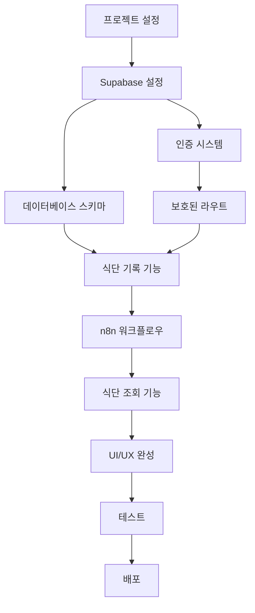

# AI 식단 관리 서비스 MVP 개발 Task 개요

## 프로젝트 구조

본 문서는 AI 식단 관리 서비스의 MVP(Minimum Viable Product) 개발을 위한 전체적인 task 구조와 의존성을 정의합니다.

## 개발 단계 (Phase)

### Phase 1: 기반 설정 및 인증 (Foundation & Authentication)
- **목표**: 프로젝트 환경 설정 및 사용자 인증 구현
- **기간 예상**: 2-3일
- **우선순위**: 최고

### Phase 2: 핵심 기능 개발 (Core Features)
- **목표**: 식단 기록 및 n8n 연동 구현
- **기간 예상**: 4-5일
- **우선순위**: 최고

### Phase 3: 데이터 조회 및 UI/UX (Data Display & UI/UX)
- **목표**: 식단 조회 기능 및 사용자 인터페이스 완성
- **기간 예상**: 3-4일
- **우선순위**: 높음

### Phase 4: 최적화 및 배포 (Optimization & Deployment)
- **목표**: 성능 최적화 및 배포 준비
- **기간 예상**: 2-3일
- **우선순위**: 중간

## Task 분류

### 🔧 설정 및 환경 (Setup & Configuration)
- [x] 프로젝트 초기 설정 완료
- [ ] 의존성 패키지 설치 및 설정
- [ ] Supabase 프로젝트 설정
- [ ] 환경변수 구성

### 🔐 인증 시스템 (Authentication)
- [ ] Supabase Auth 설정
- [ ] 로그인/회원가입 페이지 구현
- [ ] 인증 상태 관리 구현
- [ ] 보호된 라우트 설정

### 📸 식단 기록 기능 (Food Logging)
- [ ] 이미지 업로드 인터페이스 구현
- [ ] n8n 웹훅 연동 구현
- [ ] 로딩 상태 UI 구현
- [ ] 에러 처리 구현

### 📊 데이터베이스 (Database)
- [ ] Supabase 데이터베이스 스키마 설계
- [ ] 테이블 생성 및 관계 설정
- [ ] RLS(Row Level Security) 정책 설정

### 📱 사용자 인터페이스 (User Interface)
- [ ] 메인 대시보드 구현
- [ ] 식단 기록 페이지 구현
- [ ] 식단 조회 페이지 구현
- [ ] 모바일 반응형 디자인 적용

### 🔄 n8n 워크플로우 (n8n Workflow)
- [ ] n8n 워크플로우 설계
- [ ] 시간 기반 끼니 분류 로직 구현
- [ ] AI 분석 서비스 연동
- [ ] Supabase Storage 연동

### 🧪 테스트 및 검증 (Testing & Validation)
- [ ] 단위 테스트 구현
- [ ] 통합 테스트 구현
- [ ] 사용자 시나리오 테스트

### 🚀 배포 및 최적화 (Deployment & Optimization)
- [ ] 성능 최적화
- [ ] 배포 환경 설정
- [ ] 모니터링 설정

## 의존성 관계

## 다음 단계

각 Phase별 세부 task는 다음 문서들에서 확인할 수 있습니다:

1. [Phase 1: 기반 설정 및 인증](./phase-1-foundation.md)
2. [Phase 2: 핵심 기능 개발](./phase-2-core-features.md)
3. [Phase 3: 데이터 조회 및 UI/UX](./phase-3-ui-data.md)
4. [Phase 4: 최적화 및 배포](./phase-4-deployment.md)

## 진행 상황 추적

- [ ] Phase 1 완료 (0/8 tasks)
- [ ] Phase 2 완료 (0/6 tasks)
- [ ] Phase 3 완료 (0/5 tasks)
- [ ] Phase 4 완료 (0/4 tasks)

**전체 진행률: 0% (0/23 tasks)**
