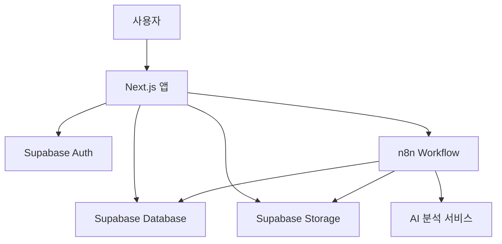

# 기술 사양서 (Technical Specifications)

## 개요
AI 식단 관리 서비스 MVP의 상세한 기술 사양을 정의한 문서입니다. 개발자가 구현 시 참고할 수 있는 구체적인 기술적 요구사항을 포함합니다.

## 시스템 아키텍처

### 전체 시스템 구조


### 기술 스택 상세

#### 프론트엔드
- **Framework**: Next.js 15.5.4 (App Router)
- **Language**: TypeScript 5.x
- **Styling**: Tailwind CSS 4.x
- **UI Components**: shadcn/ui
- **State Management**: React built-in (useState, useContext)
- **Form Handling**: React Hook Form + Zod
- **HTTP Client**: Fetch API (Native)

#### 백엔드
- **Server Actions**: Next.js App Router Server Actions
- **Runtime**: Node.js (Vercel Functions)
- **Database**: Supabase PostgreSQL
- **Authentication**: Supabase Auth
- **File Storage**: Supabase Storage
- **Workflow Engine**: n8n

#### 개발 도구
- **Package Manager**: pnpm
- **Linting**: ESLint + Prettier
- **Type Checking**: TypeScript
- **Testing**: Jest + React Testing Library (예정)

## 데이터베이스 설계

### 테이블 구조

#### 1. food_logs 테이블
```sql
CREATE TABLE food_logs (
  id UUID DEFAULT gen_random_uuid() PRIMARY KEY,
  user_id UUID REFERENCES auth.users(id) ON DELETE CASCADE NOT NULL,
  image_url TEXT NOT NULL,
  meal_type TEXT NOT NULL CHECK (meal_type IN ('아침', '점심', '저녁', '간식')),
  items JSONB NOT NULL,
  summary JSONB NOT NULL,
  confidence_score DECIMAL(3,2) CHECK (confidence_score >= 0 AND confidence_score <= 1),
  created_at TIMESTAMP WITH TIME ZONE DEFAULT NOW(),
  updated_at TIMESTAMP WITH TIME ZONE DEFAULT NOW()
);

-- 인덱스
CREATE INDEX idx_food_logs_user_date ON food_logs(user_id, created_at DESC);
CREATE INDEX idx_food_logs_meal_type ON food_logs(user_id, meal_type);
CREATE INDEX idx_food_logs_calories ON food_logs(user_id, ((summary->>'totalCalories')::numeric));
```

#### 2. JSONB 스키마 정의

**items 필드 구조:**
```typescript
interface FoodItem {
  foodName: string;
  confidence: number; // 0.0 ~ 1.0
  quantity: string;
  calories: number;
  nutrients: {
    carbohydrates: { value: number; unit: string };
    protein: { value: number; unit: string };
    fat: { value: number; unit: string };
    sugars: { value: number; unit: string };
    sodium: { value: number; unit: string };
  };
}
```

**summary 필드 구조:**
```typescript
interface NutritionSummary {
  totalCalories: number;
  totalCarbohydrates: { value: number; unit: string };
  totalProtein: { value: number; unit: string };
  totalFat: { value: number; unit: string };
}
```

### RLS (Row Level Security) 정책

```sql
-- 사용자는 자신의 기록만 조회 가능
CREATE POLICY "Users can view own food logs" ON food_logs
  FOR SELECT USING (auth.uid() = user_id);

-- 사용자는 자신의 기록만 생성 가능
CREATE POLICY "Users can create own food logs" ON food_logs
  FOR INSERT WITH CHECK (auth.uid() = user_id);

-- 사용자는 자신의 기록만 수정 가능
CREATE POLICY "Users can update own food logs" ON food_logs
  FOR UPDATE USING (auth.uid() = user_id);

-- 사용자는 자신의 기록만 삭제 가능
CREATE POLICY "Users can delete own food logs" ON food_logs
  FOR DELETE USING (auth.uid() = user_id);

-- RLS 활성화
ALTER TABLE food_logs ENABLE ROW LEVEL SECURITY;
```

## Server Actions 설계

### 인증 관련 Server Actions

#### 회원가입 Server Action
```typescript
// app/auth/actions.ts
'use server'

import { redirect } from 'next/navigation'
import { createClient } from '@/lib/supabase/server'
import { z } from 'zod'

const signupSchema = z.object({
  email: z.string().email('유효한 이메일을 입력해주세요'),
  password: z.string().min(6, '비밀번호는 최소 6자 이상이어야 합니다'),
  confirmPassword: z.string()
}).refine(data => data.password === data.confirmPassword, {
  message: '비밀번호가 일치하지 않습니다',
  path: ['confirmPassword']
})

export async function signupAction(prevState: any, formData: FormData) {
  const validatedFields = signupSchema.safeParse({
    email: formData.get('email'),
    password: formData.get('password'),
    confirmPassword: formData.get('confirmPassword')
  })

  if (!validatedFields.success) {
    return {
      errors: validatedFields.error.flatten().fieldErrors,
      message: '입력값을 확인해주세요'
    }
  }

  const { email, password } = validatedFields.data
  const supabase = await createClient()

  const { error } = await supabase.auth.signUp({
    email,
    password,
    options: {
      emailRedirectTo: `${process.env.NEXT_PUBLIC_SITE_URL}/auth/callback`
    }
  })

  if (error) {
    return {
      message: '회원가입 중 오류가 발생했습니다: ' + error.message
    }
  }

  redirect('/auth/verify-email')
}
```

#### 로그인 Server Action
```typescript
// app/auth/actions.ts
'use server'

const loginSchema = z.object({
  email: z.string().email('유효한 이메일을 입력해주세요'),
  password: z.string().min(1, '비밀번호를 입력해주세요')
})

export async function loginAction(prevState: any, formData: FormData) {
  const validatedFields = loginSchema.safeParse({
    email: formData.get('email'),
    password: formData.get('password')
  })

  if (!validatedFields.success) {
    return {
      errors: validatedFields.error.flatten().fieldErrors,
      message: '입력값을 확인해주세요'
    }
  }

  const { email, password } = validatedFields.data
  const supabase = await createClient()

  const { error } = await supabase.auth.signInWithPassword({
    email,
    password
  })

  if (error) {
    return {
      message: '로그인에 실패했습니다: ' + error.message
    }
  }

  redirect('/dashboard')
}
```

### 식단 관련 Server Actions

#### 식단 분석 Server Action
```typescript
// app/food/actions.ts
'use server'

import { createClient } from '@/lib/supabase/server'
import { redirect } from 'next/navigation'
import { revalidatePath } from 'next/cache'

interface AnalyzeResult {
  items: FoodItem[];
  summary: NutritionSummary;
  mealType: string;
  imageUrl: string;
}

export async function analyzeFoodAction(formData: FormData) {
  const supabase = await createClient()
  
  // 현재 사용자 확인
  const { data: { user }, error: authError } = await supabase.auth.getUser()
  if (authError || !user) {
    throw new Error('인증이 필요합니다')
  }

  const image = formData.get('image') as File
  if (!image) {
    throw new Error('이미지를 선택해주세요')
  }

  // 파일 크기 및 형식 검증
  if (image.size > 10 * 1024 * 1024) {
    throw new Error('파일 크기가 10MB를 초과합니다')
  }

  const allowedTypes = ['image/jpeg', 'image/png', 'image/webp']
  if (!allowedTypes.includes(image.type)) {
    throw new Error('지원하지 않는 파일 형식입니다')
  }

  try {
    // n8n 웹훅으로 분석 요청
    const webhookFormData = new FormData()
    webhookFormData.append('image', image)
    webhookFormData.append('userId', user.id)

    const response = await fetch(process.env.N8N_WEBHOOK_URL!, {
      method: 'POST',
      body: webhookFormData
    })

    if (!response.ok) {
      throw new Error('분석 서비스 오류')
    }

    const result: AnalyzeResult = await response.json()
    
    // 결과를 데이터베이스에 저장
    const { error: insertError } = await supabase
      .from('food_logs')
      .insert({
        user_id: user.id,
        image_url: result.imageUrl,
        meal_type: result.mealType,
        items: result.items,
        summary: result.summary,
        confidence_score: result.items.reduce((acc, item) => acc + item.confidence, 0) / result.items.length
      })

    if (insertError) {
      throw new Error('데이터 저장 중 오류가 발생했습니다')
    }

    // 관련 페이지 재검증
    revalidatePath('/dashboard')
    revalidatePath('/food/history')
    
    return result
  } catch (error) {
    throw new Error(error instanceof Error ? error.message : '분석 중 오류가 발생했습니다')
  }
}
```

#### 식단 기록 조회 Server Action
```typescript
// app/food/actions.ts
'use server'

interface GetLogsParams {
  date?: string;
  mealType?: string;
  page?: number;
  limit?: number;
  sortBy?: 'created_at' | 'calories';
  sortOrder?: 'asc' | 'desc';
}

export async function getFoodLogsAction(params: GetLogsParams = {}) {
  const supabase = await createClient()
  
  const { data: { user }, error: authError } = await supabase.auth.getUser()
  if (authError || !user) {
    throw new Error('인증이 필요합니다')
  }

  const {
    date,
    mealType,
    page = 1,
    limit = 20,
    sortBy = 'created_at',
    sortOrder = 'desc'
  } = params

  let query = supabase
    .from('food_logs')
    .select('*')
    .eq('user_id', user.id)

  // 날짜 필터
  if (date) {
    query = query.gte('created_at', `${date}T00:00:00.000Z`)
                 .lt('created_at', `${date}T23:59:59.999Z`)
  }

  // 끼니 필터
  if (mealType && mealType !== 'all') {
    query = query.eq('meal_type', mealType)
  }

  // 정렬
  const orderColumn = sortBy === 'calories' ? 'summary->totalCalories' : sortBy
  query = query.order(orderColumn, { ascending: sortOrder === 'asc' })

  // 페이지네이션
  const from = (page - 1) * limit
  const to = from + limit - 1
  query = query.range(from, to)

  const { data: logs, error, count } = await query

  if (error) {
    throw new Error('식단 기록 조회 중 오류가 발생했습니다')
  }

  // 일일 요약 계산
  const summary = calculateDailySummary(logs || [], date)

  return {
    logs: logs || [],
    pagination: {
      total: count || 0,
      page,
      limit,
      totalPages: Math.ceil((count || 0) / limit)
    },
    summary
  }
}
```

#### 통계 조회 Server Action
```typescript
// app/food/actions.ts
'use server'

interface GetStatsParams {
  period: 'day' | 'week' | 'month';
  startDate: string;
  endDate?: string;
}

export async function getFoodStatsAction(params: GetStatsParams) {
  const supabase = await createClient()
  
  const { data: { user }, error: authError } = await supabase.auth.getUser()
  if (authError || !user) {
    throw new Error('인증이 필요합니다')
  }

  const { period, startDate, endDate } = params
  const actualEndDate = endDate || new Date().toISOString().split('T')[0]

  const { data: logs, error } = await supabase
    .from('food_logs')
    .select('created_at, meal_type, summary')
    .eq('user_id', user.id)
    .gte('created_at', `${startDate}T00:00:00.000Z`)
    .lte('created_at', `${actualEndDate}T23:59:59.999Z`)
    .order('created_at', { ascending: true })

  if (error) {
    throw new Error('통계 데이터 조회 중 오류가 발생했습니다')
  }

  // 통계 데이터 계산
  const stats = calculateStats(logs || [], period)
  
  return stats
}
```

## n8n 워크플로우 사양

### 웹훅 엔드포인트
- **URL**: `https://your-n8n-instance.com/webhook/food-analysis`
- **Method**: POST
- **Content-Type**: multipart/form-data

### 워크플로우 단계

#### 1. Webhook Trigger
```json
{
  "settings": {
    "httpMethod": "POST",
    "path": "food-analysis",
    "responseMode": "responseNode"
  }
}
```

#### 2. 끼니 분류 로직 (JavaScript Code Node)
```javascript
// 현재 시간 기준 끼니 분류
const now = new Date();
const hour = now.getHours();

let mealType;
if (hour >= 4 && hour < 11) {
  mealType = '아침';
} else if (hour >= 11 && hour < 17) {
  mealType = '점심';
} else if (hour >= 17 && hour < 22) {
  mealType = '저녁';
} else {
  mealType = '간식';
}

return {
  mealType,
  timestamp: now.toISOString(),
  userId: $input.all()[0].json.userId,
  imageData: $input.all()[0].binary.image
};
```

#### 3. AI 분석 서비스 호출 (HTTP Request Node)
```json
{
  "method": "POST",
  "url": "https://api.your-ai-service.com/analyze",
  "sendBinaryData": true,
  "binaryPropertyName": "image",
  "headers": {
    "Authorization": "Bearer {{ $env.AI_API_KEY }}"
  }
}
```

#### 4. Supabase Storage 업로드 (HTTP Request Node)
```json
{
  "method": "POST",
  "url": "https://your-project.supabase.co/storage/v1/object/food-images/{{ $json.userId }}/{{ $json.timestamp }}.jpg",
  "headers": {
    "Authorization": "Bearer {{ $env.SUPABASE_SERVICE_KEY }}",
    "Content-Type": "image/jpeg"
  },
  "sendBinaryData": true
}
```

#### 5. 데이터베이스 저장 (Supabase Node)
```json
{
  "operation": "insert",
  "table": "food_logs",
  "records": [
    {
      "user_id": "{{ $json.userId }}",
      "image_url": "{{ $json.imageUrl }}",
      "meal_type": "{{ $json.mealType }}",
      "items": "{{ $json.aiAnalysis.items }}",
      "summary": "{{ $json.aiAnalysis.summary }}",
      "confidence_score": "{{ $json.aiAnalysis.confidence }}"
    }
  ]
}
```

## 프론트엔드 컴포넌트 구조

### 디렉토리 구조
```
app/
├── (auth)/
│   ├── login/
│   │   └── page.tsx
│   ├── signup/
│   │   └── page.tsx
│   └── layout.tsx
├── dashboard/
│   └── page.tsx
├── food/
│   ├── record/
│   │   └── page.tsx
│   └── history/
│       └── page.tsx
├── actions/
│   ├── auth.ts
│   ├── food.ts
│   └── dashboard.ts
├── globals.css
├── layout.tsx
└── page.tsx

components/
├── auth/
│   ├── LoginForm.tsx
│   ├── SignUpForm.tsx
│   └── AuthProvider.tsx
├── dashboard/
│   ├── DashboardHeader.tsx
│   ├── QuickRecordButton.tsx
│   └── RecentSummary.tsx
├── food/
│   ├── ImageUploader.tsx
│   ├── ImagePreview.tsx
│   ├── AnalysisResult.tsx
│   ├── FoodLogCard.tsx
│   └── FoodDetailModal.tsx
├── stats/
│   ├── CalorieChart.tsx
│   ├── NutritionChart.tsx
│   └── StatsOverview.tsx
├── layout/
│   ├── Navigation.tsx
│   └── Header.tsx
├── common/
│   ├── LoadingSpinner.tsx
│   ├── ErrorBoundary.tsx
│   └── Toast.tsx
└── ui/
    ├── button.tsx
    ├── input.tsx
    ├── card.tsx
    └── form.tsx

lib/
├── supabase/
│   ├── client.ts
│   └── server.ts
├── utils/
│   ├── validation.ts
│   ├── formatting.ts
│   └── constants.ts
├── hooks/
│   ├── useAuth.ts
│   ├── useFoodLogs.ts
│   └── useImageUpload.ts
├── actions/
│   ├── auth.ts
│   ├── food.ts
│   └── dashboard.ts
└── types/
    ├── auth.ts
    ├── food.ts
    └── actions.ts
```

### 주요 컴포넌트 Props 인터페이스

#### ImageUploader
```typescript
interface ImageUploaderProps {
  onUpload: (file: File) => Promise<void>;
  onError: (error: string) => void;
  maxSize?: number; // MB
  acceptedTypes?: string[];
  disabled?: boolean;
  className?: string;
}
```

#### FoodLogCard
```typescript
interface FoodLogCardProps {
  log: FoodLog;
  onClick?: (log: FoodLog) => void;
  showDate?: boolean;
  compact?: boolean;
  className?: string;
}
```

#### AnalysisResult
```typescript
interface AnalysisResultProps {
  items: FoodItem[];
  summary: NutritionSummary;
  mealType: string;
  imageUrl: string;
  onConfirm: () => void;
  onRetry: () => void;
  loading?: boolean;
}
```

## 상태 관리 패턴

### 인증 상태 관리
```typescript
// hooks/useAuth.ts
interface AuthState {
  user: User | null;
  loading: boolean;
  error: string | null;
}

interface AuthActions {
  signIn: (email: string, password: string) => Promise<void>;
  signUp: (email: string, password: string) => Promise<void>;
  signOut: () => Promise<void>;
  resetPassword: (email: string) => Promise<void>;
}

export function useAuth(): AuthState & AuthActions;
```

### 식단 기록 상태 관리
```typescript
// hooks/useFoodLogs.ts
interface FoodLogsState {
  logs: FoodLog[];
  loading: boolean;
  error: string | null;
  hasMore: boolean;
  filters: {
    date: string;
    mealType: string;
  };
}

interface FoodLogsActions {
  fetchLogs: (filters?: Partial<FoodLogsState['filters']>) => Promise<void>;
  loadMore: () => Promise<void>;
  setFilters: (filters: Partial<FoodLogsState['filters']>) => void;
  refresh: () => Promise<void>;
}

export function useFoodLogs(): FoodLogsState & FoodLogsActions;
```

## 에러 처리 전략

### 에러 타입 정의
```typescript
interface AppError {
  code: string;
  message: string;
  details?: any;
  timestamp: string;
}

// 에러 코드 상수
export const ERROR_CODES = {
  // 인증 관련
  AUTH_INVALID_CREDENTIALS: 'AUTH_INVALID_CREDENTIALS',
  AUTH_USER_NOT_FOUND: 'AUTH_USER_NOT_FOUND',
  AUTH_EMAIL_ALREADY_EXISTS: 'AUTH_EMAIL_ALREADY_EXISTS',
  
  // 파일 업로드 관련
  FILE_TOO_LARGE: 'FILE_TOO_LARGE',
  FILE_INVALID_FORMAT: 'FILE_INVALID_FORMAT',
  UPLOAD_FAILED: 'UPLOAD_FAILED',
  
  // AI 분석 관련
  AI_NO_FOOD_DETECTED: 'AI_NO_FOOD_DETECTED',
  AI_LOW_CONFIDENCE: 'AI_LOW_CONFIDENCE',
  AI_SERVICE_UNAVAILABLE: 'AI_SERVICE_UNAVAILABLE',
  
  // 네트워크 관련
  NETWORK_TIMEOUT: 'NETWORK_TIMEOUT',
  NETWORK_OFFLINE: 'NETWORK_OFFLINE',
  SERVER_ERROR: 'SERVER_ERROR'
} as const;
```

### 에러 메시지 다국어화
```typescript
export const ERROR_MESSAGES: Record<string, string> = {
  [ERROR_CODES.AUTH_INVALID_CREDENTIALS]: '이메일 또는 비밀번호가 올바르지 않습니다.',
  [ERROR_CODES.FILE_TOO_LARGE]: '파일 크기가 너무 큽니다. (최대 10MB)',
  [ERROR_CODES.AI_NO_FOOD_DETECTED]: '이미지에서 음식을 찾을 수 없습니다. 다른 사진으로 시도해주세요.',
  [ERROR_CODES.NETWORK_TIMEOUT]: '요청 시간이 초과되었습니다. 다시 시도해주세요.',
  // ... 기타 메시지들
};
```

## 성능 최적화 가이드라인

### 이미지 최적화
```typescript
// next.config.ts
const nextConfig = {
  images: {
    domains: ['your-supabase-project.supabase.co'],
    formats: ['image/webp', 'image/avif'],
    deviceSizes: [640, 750, 828, 1080, 1200, 1920, 2048, 3840],
    imageSizes: [16, 32, 48, 64, 96, 128, 256, 384],
    minimumCacheTTL: 60 * 60 * 24 * 7, // 7 days
  },
};
```

### 코드 스플리팅
```typescript
// 동적 import 예시
const FoodDetailModal = dynamic(
  () => import('@/components/food/FoodDetailModal'),
  {
    loading: () => <div className="animate-pulse">로딩 중...</div>,
    ssr: false
  }
);

const StatsChart = dynamic(
  () => import('@/components/stats/CalorieChart'),
  {
    loading: () => <ChartSkeleton />,
    ssr: false
  }
);
```

### 데이터베이스 쿼리 최적화
```sql
-- 효율적인 쿼리 예시
SELECT 
  id,
  meal_type,
  summary->>'totalCalories' as calories,
  created_at
FROM food_logs 
WHERE user_id = $1 
  AND created_at::date = $2
ORDER BY created_at DESC
LIMIT 20;

-- 통계 쿼리 최적화
SELECT 
  DATE(created_at) as date,
  meal_type,
  SUM((summary->>'totalCalories')::numeric) as total_calories,
  COUNT(*) as meal_count
FROM food_logs 
WHERE user_id = $1 
  AND created_at >= $2 
  AND created_at <= $3
GROUP BY DATE(created_at), meal_type
ORDER BY date DESC;
```

## 보안 고려사항

### 입력값 검증
```typescript
// 서버사이드 검증 예시
import { z } from 'zod';

const imageUploadSchema = z.object({
  file: z.instanceof(File)
    .refine(file => file.size <= 10 * 1024 * 1024, '파일 크기 초과')
    .refine(file => ['image/jpeg', 'image/png', 'image/webp'].includes(file.type), '지원하지 않는 형식'),
  userId: z.string().uuid('유효하지 않은 사용자 ID')
});

export async function validateImageUpload(formData: FormData) {
  try {
    return imageUploadSchema.parse({
      file: formData.get('image'),
      userId: formData.get('userId')
    });
  } catch (error) {
    throw new Error('입력값 검증 실패');
  }
}
```

### Server Actions 레이트 리미팅
```typescript
// lib/rate-limit.ts
import { Ratelimit } from '@upstash/ratelimit';
import { headers } from 'next/headers';

export const ratelimit = new Ratelimit({
  redis: Redis.fromEnv(),
  limiter: Ratelimit.slidingWindow(10, '1 m'), // 1분에 10회
  analytics: true,
});

// Server Action에서 사용
export async function rateLimitedAction() {
  'use server'
  
  const headersList = await headers()
  const ip = headersList.get('x-forwarded-for') ?? '127.0.0.1'
  const { success } = await ratelimit.limit(ip)
  
  if (!success) {
    throw new Error('요청이 너무 많습니다. 잠시 후 다시 시도해주세요.')
  }
  
  // ... 실제 로직
}
```

## 테스트 전략

### 단위 테스트 예시
```typescript
// __tests__/components/ImageUploader.test.tsx
import { render, screen, fireEvent } from '@testing-library/react';
import { ImageUploader } from '@/components/food/ImageUploader';

describe('ImageUploader', () => {
  it('파일 선택 시 onUpload 호출', async () => {
    const mockOnUpload = jest.fn();
    render(<ImageUploader onUpload={mockOnUpload} />);
    
    const fileInput = screen.getByRole('button', { name: /이미지 선택/i });
    const file = new File(['test'], 'test.jpg', { type: 'image/jpeg' });
    
    fireEvent.change(fileInput, { target: { files: [file] } });
    
    expect(mockOnUpload).toHaveBeenCalledWith(file);
  });
  
  it('큰 파일 업로드 시 에러 표시', () => {
    const mockOnError = jest.fn();
    render(<ImageUploader onError={mockOnError} maxSize={5} />);
    
    const fileInput = screen.getByRole('button');
    const largeFile = new File(['x'.repeat(6 * 1024 * 1024)], 'large.jpg', { 
      type: 'image/jpeg' 
    });
    
    fireEvent.change(fileInput, { target: { files: [largeFile] } });
    
    expect(mockOnError).toHaveBeenCalledWith('파일 크기가 너무 큽니다.');
  });
});
```

### Server Actions 테스트 예시
```typescript
// __tests__/actions/food.test.ts
import { analyzeFoodAction } from '@/app/food/actions';
import { createMockFormData } from '@/lib/test-utils';

// 모킹
jest.mock('@/lib/supabase/server')
jest.mock('next/navigation')

describe('analyzeFoodAction', () => {
  it('유효한 이미지 분석 요청', async () => {
    const formData = createMockFormData({
      image: new File(['test'], 'test.jpg', { type: 'image/jpeg' })
    })
    
    const result = await analyzeFoodAction(formData)
    
    expect(result).toHaveProperty('items')
    expect(result).toHaveProperty('summary')
    expect(result.items).toBeInstanceOf(Array)
  })
  
  it('잘못된 파일 형식 에러', async () => {
    const formData = createMockFormData({
      image: new File(['test'], 'test.pdf', { type: 'application/pdf' })
    })
    
    await expect(analyzeFoodAction(formData))
      .rejects
      .toThrow('지원하지 않는 파일 형식입니다')
  })
})
```

이 기술 사양서는 개발 과정에서 지속적으로 업데이트되어야 하며, 실제 구현 과정에서 발견되는 요구사항에 따라 조정될 수 있습니다.
